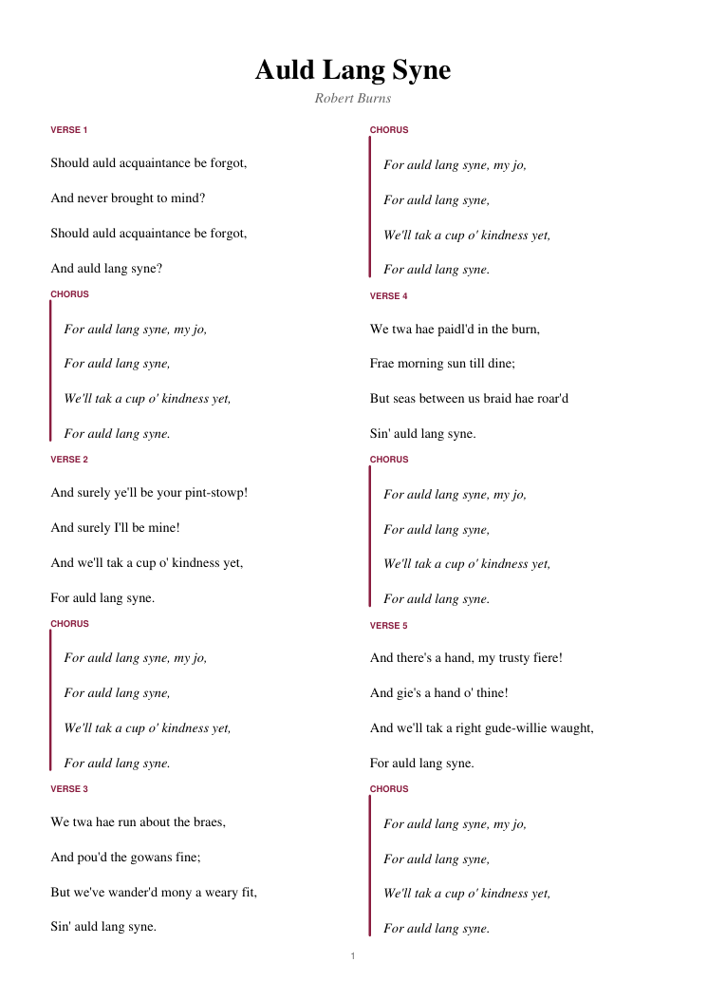

# lyrics2pdf

[](https://www.python.org/)
[](LICENSE)

Turn a plain-text lyrics file into a clean, printable **one-page lyric sheet**, with space above every line to pencil in chords.

Paste lyrics from anywhere into a `.txt` file, run one command, and print. Useful for rehearsals, jam sessions, music lessons or a home-made songbook.

<p align="center">
  <a href="examples/auld_lang_syne.pdf"></a>
</p>

## Features

- **Fits on one page.** Line spacing is chosen automatically: the largest spacing that still fits the whole song on one A4 page.
- **Room for chords.** The extra spacing goes *above* each lyric line, which is where chords are written.
- **Recognises song structure.** Tag sections yourself (`[Verse 1]`, `[Chorus]`, `[Bridge]` ...), or don't: any stanza that appears more than once is marked as the chorus and the rest are numbered as verses.
- **Choruses stand out** in italics with an accent bar, so you can find them at a glance while playing.
- **One or two columns**, for short and long songs.
- A single Python file with one dependency ([ReportLab](https://pypi.org/project/reportlab/)).

## Installation

Requires Python 3.10 or newer.

**As a command** (recommended), with [pipx](https://pipx.pypa.io/) or [uv](https://docs.astral.sh/uv/):

```bash
pipx install git+https://github.com/pavoras/lyrics2pdf
# or
uv tool install git+https://github.com/pavoras/lyrics2pdf
```

This gives you a `lyrics2pdf` command.

**Or run the script directly:**

```bash
git clone https://github.com/pavoras/lyrics2pdf
cd lyrics2pdf
pip install -r requirements.txt
python lyrics2pdf.py examples/auld_lang_syne.txt
```

## Quick start

1. Save the lyrics as a UTF-8 text file, with a blank line between stanzas, e.g. `wonderwall.txt`.
2. Run:

   ```bash
   lyrics2pdf wonderwall.txt -t "Wonderwall" -a "Oasis"
   ```

3. Open `wonderwall.pdf` and print it.

The output tells you how it went:

```
wrote wonderwall.pdf  (9 stanzas, line spacing 24.3 pt = 2.1x font size, 1 page(s))
```

## Options

```
lyrics2pdf SRC [-t TITLE] [-a ARTIST] [-o OUT] [--cols {1,2}] [--leading PT]
```

| Option | Default | Description |
| --- | --- | --- |
| `SRC` | | Lyrics file (UTF-8 plain text) |
| `-t`, `--title` | from the file name (`my_song.txt` becomes "My Song") | Song title at the top |
| `-a`, `--artist` | none | Artist line under the title |
| `-o`, `--out` | `SRC` with `.pdf` extension | Where to write the PDF |
| `--cols` | `1` | `1` or `2` columns |
| `--leading` | auto | Fixed line spacing in points, instead of auto-fit |

## Input format

Plain text, one lyric line per line, **stanzas separated by blank lines**.

### With section tags

Put a tag in square brackets on its own line before a stanza. The tag is printed as the section label.

```
[Verse 1]
First line of the verse
Second line of the verse

[Chorus]
Chorus line one
Chorus line two

[Bridge]
...
```

Any label works (`[Pre-Chorus]`, `[Strophe 2]`, `[Solo]` ...). Labels containing **"chorus"** or **"refrain"** get the chorus style.

### Without tags

Just separate stanzas with blank lines. lyrics2pdf labels them for you:

- a stanza whose text appears more than once becomes **Chorus**
- every other stanza becomes **Verse 1**, **Verse 2**, ...

You can mix both: tagged stanzas keep their tag, untagged ones are labelled automatically. A tag only applies to the stanza directly after it.

## Tips

- **Song too long for one page?** You'll see `warning: does not fit on one page even at minimum spacing`. Try `--cols 2` first. If it still doesn't fit, the PDF simply continues on a second page.
- **Short song with huge gaps?** Auto-fit uses up the whole page. Set a fixed spacing instead, e.g. `--leading 24` (about 2x the font size). Around 13.8 pt leaves no room for chords.
- **Lyrics copied from a website** often have extra blank lines inside stanzas or none between them. Tidy those first, since blank lines decide where stanzas begin and end.
- Characters like `&`, `<` and `>` are safe to use.

## Limitations

- Page size is A4.
- Uses the standard PDF fonts (Times, Helvetica), which cover Western European characters (accents, umlauts, curly quotes, dashes). **Other scripts such as Cyrillic, Greek or CJK are not supported** and show up as black boxes.
- Chords are not parsed or printed; the space above each line is for writing them by hand.

## Example

[`examples/auld_lang_syne.txt`](examples/auld_lang_syne.txt) (public domain, Robert Burns, 1788) contains no tags. Running

```bash
lyrics2pdf examples/auld_lang_syne.txt -a "Robert Burns" --cols 2
```

produces [`examples/auld_lang_syne.pdf`](examples/auld_lang_syne.pdf), the sheet shown above, with the repeated chorus detected automatically.

Please respect copyright when sharing PDFs of song lyrics.

## License

[MIT](LICENSE)
